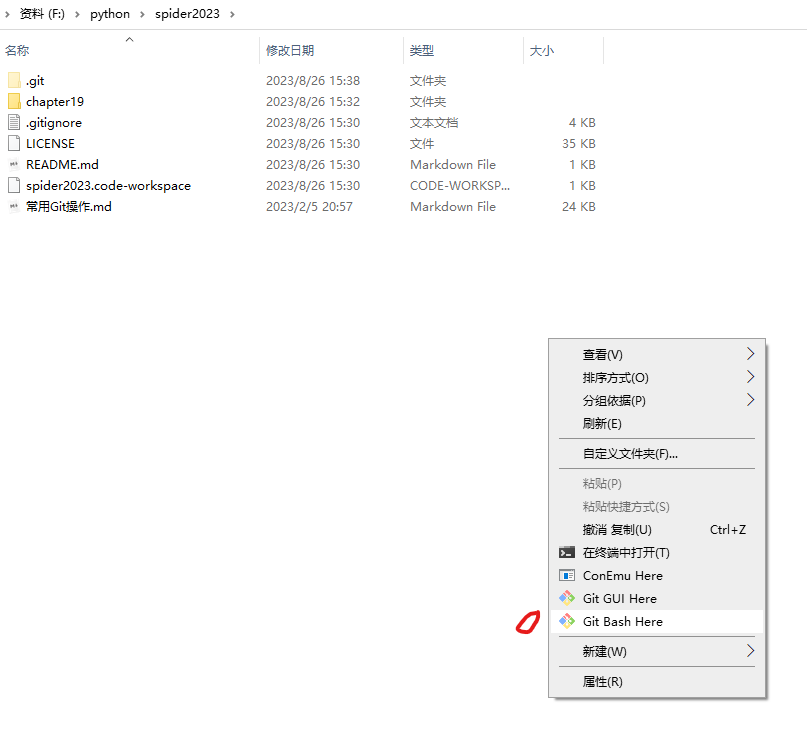

# 常用Git操作

## 本地仓库的使用

> 在工作文件夹下空白处右键，选择Git Bash Here，如下图：



> 添加本地文件修改，可使用以下两个命令。

``` {.line-numbers highlight=[1]}
hero@hero:~/git/hero$ git fetch origin
Username for 'https://github.com': zyq5428	
Password for 'https://zyq5428@github.com': 
remote: Enumerating objects: 4, done.
remote: Counting objects: 100% (4/4), done.
remote: Compressing objects: 100% (2/2), done.
remote: Total 3 (delta 0), reused 0 (delta 0), pack-reused 0
Unpacking objects: 100% (3/3), done.
From https://github.com/zyq5428/hero
   1432267..7d696db  master     -> origin/master
hero@hero:~/git/hero$
```

### 添加本地仓库更改

> git fetch [remote-name]
> 这个命令会访问远程仓库，从中拉取所有你还没有的数据。执行完成后，你将会拥有那个远程仓库中所有分支的引用，可以随时合并或查看。
>
> 如果你使用 clone 命令克隆了一个仓库，命令会自动将其添加为远程仓库并默认以 “origin” 为简写。所以，git fetch origin 会抓取克隆（或上一次抓取）后新推送的所有工作。**必须注意 git fetch 命令会将数据拉取到你的本地仓库 - 它并不会自动合并或修改你当前的工作。**当准备好时你必须手动将其合并入你的工作。
>
> 如果你有一个分支设置为跟踪一个远程分支（阅读下一节与 Git 分支 了解更多信息），可以使用 git pull 命令来自动的抓取然后合并远程分支到当前分支。这对你来说可能是一个更简单或更舒服的工作流程；默认情况
下，git clone 命令会自动设置本地 master 分支跟踪克隆的远程仓库的 master 分支（或不管是什么名字的默认分支）。运行 git pull 通常会从最初克隆的服务器上抓取数据并自动尝试合并到当前所在的分支。

``` {.line-numbers highlight=[1]}
hero@hero:~/git/hero$ git fetch origin
Username for 'https://github.com': zyq5428	
Password for 'https://zyq5428@github.com': 
remote: Enumerating objects: 4, done.
remote: Counting objects: 100% (4/4), done.
remote: Compressing objects: 100% (2/2), done.
remote: Total 3 (delta 0), reused 0 (delta 0), pack-reused 0
Unpacking objects: 100% (3/3), done.
From https://github.com/zyq5428/hero
   1432267..7d696db  master     -> origin/master
hero@hero:~/git/hero$
```

> 要特别注意的一点是当抓取到新的远程跟踪分支时，本地不会自动生成一份可编辑的副本（拷贝）。换一句话说，这种情况下，不会有一个新的 master 分支 - 只有一个不可以修改的 origin/master 指针。
>
> 可以运行 git merge origin/master 将这些工作合并到当前所在的分支。如果想要在自己的master 分支上工作，可以将其建立在远程跟踪分支之上：

``` {.line-numbers highlight=[1, 3, 9]}
hero@hero:~/git/hero$ ls
README.md
hero@hero:~/git/hero$ git merge origin/master
Updating 1432267..7d696db
Fast-forward
 fetch.txt | 1 +
 1 file changed, 1 insertion(+)
 create mode 100644 fetch.txt
hero@hero:~/git/hero$ ls
fetch.txt  README.md
hero@hero:~/git/hero$ git log
commit 7d696db341eadb28244d4619ed420d2905974320 (HEAD -> master, origin/master, origin/HEAD)
Author: zyq5428 <594270026@qq.com>
Date:   Mon Jan 13 17:32:13 2020 +0800

    fetch test
    
    fetch test operation

commit 143226717d3623c7a66564d439c3749ba8dcfa19
Author: zyq5428 <594270026@qq.com>
Date:   Wed Oct 23 17:29:14 2019 +0800

    Initial commit
hero@hero:~/git/hero$
```

## 远程仓库的使用

### 从远程仓库中抓取与拉取

> git fetch [remote-name]
> 这个命令会访问远程仓库，从中拉取所有你还没有的数据。执行完成后，你将会拥有那个远程仓库中所有分支的引用，可以随时合并或查看。
>
> 如果你使用 clone 命令克隆了一个仓库，命令会自动将其添加为远程仓库并默认以 “origin” 为简写。所以，git fetch origin 会抓取克隆（或上一次抓取）后新推送的所有工作。**必须注意 git fetch 命令会将数据拉取到你的本地仓库 - 它并不会自动合并或修改你当前的工作。**当准备好时你必须手动将其合并入你的工作。
>
> 如果你有一个分支设置为跟踪一个远程分支（阅读下一节与 Git 分支 了解更多信息），可以使用 git pull 命令来自动的抓取然后合并远程分支到当前分支。这对你来说可能是一个更简单或更舒服的工作流程；默认情况
下，git clone 命令会自动设置本地 master 分支跟踪克隆的远程仓库的 master 分支（或不管是什么名字的默认分支）。运行 git pull 通常会从最初克隆的服务器上抓取数据并自动尝试合并到当前所在的分支。

``` {.line-numbers highlight=[1]}
hero@hero:~/git/hero$ git fetch origin
Username for 'https://github.com': zyq5428	
Password for 'https://zyq5428@github.com': 
remote: Enumerating objects: 4, done.
remote: Counting objects: 100% (4/4), done.
remote: Compressing objects: 100% (2/2), done.
remote: Total 3 (delta 0), reused 0 (delta 0), pack-reused 0
Unpacking objects: 100% (3/3), done.
From https://github.com/zyq5428/hero
   1432267..7d696db  master     -> origin/master
hero@hero:~/git/hero$
```

> 要特别注意的一点是当抓取到新的远程跟踪分支时，本地不会自动生成一份可编辑的副本（拷贝）。换一句话说，这种情况下，不会有一个新的 master 分支 - 只有一个不可以修改的 origin/master 指针。
>
> 可以运行 git merge origin/master 将这些工作合并到当前所在的分支。如果想要在自己的master 分支上工作，可以将其建立在远程跟踪分支之上：

``` {.line-numbers highlight=[1, 3, 9]}
hero@hero:~/git/hero$ ls
README.md
hero@hero:~/git/hero$ git merge origin/master
Updating 1432267..7d696db
Fast-forward
 fetch.txt | 1 +
 1 file changed, 1 insertion(+)
 create mode 100644 fetch.txt
hero@hero:~/git/hero$ ls
fetch.txt  README.md
hero@hero:~/git/hero$ git log
commit 7d696db341eadb28244d4619ed420d2905974320 (HEAD -> master, origin/master, origin/HEAD)
Author: zyq5428 <594270026@qq.com>
Date:   Mon Jan 13 17:32:13 2020 +0800

    fetch test
    
    fetch test operation

commit 143226717d3623c7a66564d439c3749ba8dcfa19
Author: zyq5428 <594270026@qq.com>
Date:   Wed Oct 23 17:29:14 2019 +0800

    Initial commit
hero@hero:~/git/hero$
```

> git pull自动拉取并合并

``` {.line-numbers highlight=[1, 16, 18]}
hero@hero:~/git/hero$ git pull
Username for 'https://github.com': zyq5428
Password for 'https://zyq5428@github.com': 
remote: Enumerating objects: 4, done.
remote: Counting objects: 100% (4/4), done.
remote: Compressing objects: 100% (2/2), done.
remote: Total 3 (delta 0), reused 0 (delta 0), pack-reused 0
Unpacking objects: 100% (3/3), done.
From https://github.com/zyq5428/hero
   7d696db..1898fc3  master     -> origin/master
Updating 7d696db..1898fc3
Fast-forward
 pull.txt | 1 +
 1 file changed, 1 insertion(+)
 create mode 100644 pull.txt
hero@hero:~/git/hero$ ls
fetch.txt  pull.txt  README.md
hero@hero:~/git/hero$ git log
commit 1898fc375aa2d6f053b3921ad1261e076ebf2f7e (HEAD -> master, origin/master, origin/HEAD)
Author: zyq5428 <594270026@qq.com>
Date:   Mon Jan 13 17:57:32 2020 +0800

    pull test
    
    pull test operation

commit 7d696db341eadb28244d4619ed420d2905974320
Author: zyq5428 <594270026@qq.com>
Date:   Mon Jan 13 17:32:13 2020 +0800

    fetch test
    
    fetch test operation

commit 143226717d3623c7a66564d439c3749ba8dcfa19
Author: zyq5428 <594270026@qq.com>
Date:   Wed Oct 23 17:29:14 2019 +0800

    Initial commit
hero@hero:~/git/hero$
```

> 直观查看分叉历史的命令：
> **git log --oneline --decorate --graph --all**

> **设置已有的本地分支跟踪一个刚刚拉取下来的远程分支，或者想要修改正在跟踪的上游分支，你可以在任意时间使用 -u 或 --set-upstream-to 选项运行 git branch 来显式地设置。**

> **需要重点注意的一点是这些数字的值来自于你从每个服务器上最后一次抓取的数据**。这个命令并没有连接服务器，它只会告诉你关于本地缓存的服务器数据。如果想要统计最新的领先与落后数字，需要在运行此命令前抓取所有的远程仓库。可以像这样做：$ git fetch --all; git branch -vv

### 分支管理

> **git branch** 命令不只是可以创建与删除分支。如果不加任何参数运行它，会得到当前所有分支的一个列表：

``` {.line-numbers highlight=[1]}
hero@hero:~/git/hero$ git branch
  master
* track
hero@hero:~/git/hero$
```

> 注意 master 分支前的 * 字符：它代表现在检出的那一个分支（也就是说，当前 HEAD 指针所指向的分支）。这意味着如果在这时候提交，master 分支将会随着新的工作向前移动。如果需要查看每一个分支的最后一次提交，可以运行 **git branch -v** 命令：

``` {.line-numbers highlight=[1]}
hero@hero:~/git/hero$ git branch -v
  master 1898fc3 pull test
* track  5da5b79 trach push operation
hero@hero:~/git/hero$
```

> --merged 与 --no-merged 这两个有用的选项可以过滤这个列表中已经合并或尚未合并到当前分支的分支。

#### 分支的合并

> 假设你打算将你的工作合并入 master 分支。为此，你需要合并 track 分支到master 分支。你只需要检出到你想合并入的分支，然后运行git merge 命令：

``` {.line-numbers highlight=[1, 4, 8, 11]}
hero@hero:~/git/hero$ git branch -v
  master 1898fc3 pull test
* track  5da5b79 trach push operation
hero@hero:~/git/hero$ git checkout master
Switched to branch 'master'
Your branch is up to date with 'origin/master'.
hero@hero:~/git/hero$ git branch -v
* master 1898fc3 pull test
  track  5da5b79 trach push operation
hero@hero:~/git/hero$ git merge track
Updating 1898fc3..5da5b79
Fast-forward
 track.txt      | 1 +
 track_push.txt | 1 +
 2 files changed, 2 insertions(+)
 create mode 100644 track.txt
 create mode 100644 track_push.txt
hero@hero:~/git/hero$ ls
fetch.txt  pull.txt  README.md  track_push.txt  track.txt
hero@hero:~/git/hero$ git branch -v
* master 5da5b79 [ahead 2] trach push operation
  track  5da5b79 trach push operation
hero@hero:~/git/hero$
```

> 推送合并后的master到远程服务器：

``` {.line-numbers highlight=[1]}
hero@hero:~/git/hero$ git branch -v
  master 1898fc3 pull test
* track  5da5b79 trach push operation
hero@hero:~/git/hero$
```

## 版本回退

### 回退到旧版本

``` {.line-numbers highlight=[1]}
hero@hero:~/git/hero$ git log --pretty=oneline
5da5b79908af98ab5ebf6c7d0c0e86a8477f8b39 (HEAD -> master, origin/track, origin/master, origin/HEAD, track) trach push operation
22f0376869a7eb7199e99a403356c2ebd1725599 track test
1898fc375aa2d6f053b3921ad1261e076ebf2f7e pull test
7d696db341eadb28244d4619ed420d2905974320 fetch test
143226717d3623c7a66564d439c3749ba8dcfa19 Initial commit
hero@hero:~/git/hero$ git reset --hard 1898fc375aa2d6f053b3921ad1261e076ebf2f7e
HEAD is now at 1898fc3 pull test
hero@hero:~/git/hero$ git log --pretty=oneline
1898fc375aa2d6f053b3921ad1261e076ebf2f7e (HEAD -> master) pull test
7d696db341eadb28244d4619ed420d2905974320 fetch test
143226717d3623c7a66564d439c3749ba8dcfa19 Initial commit
hero@hero:~/git/hero$ ls
fetch.txt  pull.txt  README.md
hero@hero:~/git/hero$
```

### 返回到最新版本

``` {.line-numbers highlight=[1]}
hero@hero:~/git/hero$ git reflog
1898fc3 (HEAD -> master) HEAD@{0}: reset: moving to 1898fc375aa2d6f053b3921ad1261e076ebf2f7e
5da5b79 (origin/track, origin/master, origin/HEAD, track) HEAD@{1}: merge track: Fast-forward
1898fc3 (HEAD -> master) HEAD@{2}: checkout: moving from track to master
5da5b79 (origin/track, origin/master, origin/HEAD, track) HEAD@{3}: commit: trach push operation
22f0376 HEAD@{4}: checkout: moving from master to track
1898fc3 (HEAD -> master) HEAD@{5}: pull: Fast-forward
7d696db HEAD@{6}: merge origin/master: Fast-forward
1432267 HEAD@{7}: clone: from https://github.com/zyq5428/hero.git
hero@hero:~/git/hero$ git reset --hard 5da5b79
HEAD is now at 5da5b79 trach push operation
hero@hero:~/git/hero$ ls
fetch.txt  pull.txt  README.md  track_push.txt  track.txt
hero@hero:~/git/hero$ git branch -v
* master 5da5b79 trach push operation
  track  5da5b79 trach push operation
hero@hero:~/git/hero$ git log --pretty=oneline
5da5b79908af98ab5ebf6c7d0c0e86a8477f8b39 (HEAD -> master, origin/track, origin/master, origin/HEAD, track) trach push operation
22f0376869a7eb7199e99a403356c2ebd1725599 track test
1898fc375aa2d6f053b3921ad1261e076ebf2f7e pull test
7d696db341eadb28244d4619ed420d2905974320 fetch test
143226717d3623c7a66564d439c3749ba8dcfa19 Initial commit
hero@hero:~/git/hero$
```

> reset三种模式区别和使用场景
>
> **区别**：
>
> 1. --hard：重置位置的同时，直接将 working Tree工作目录、 index 暂存区及 repository 都重置成目标Reset节点的內容,所以效果看起来等同于清空暂存区和工作区。
>
> 2. --soft：重置位置的同时，保留working Tree工作目录和index暂存区的内容，只让repository中的内容和 reset 目标节点保持一致，因此原节点和reset节点之间的【差异变更集】会放入index暂存区中(Staged files)。所以效果看起来就是工作目录的内容不变，暂存区原有的内容也不变，只是原节点和Reset节点之间的所有差异都会放到暂存区中。
>
> 3. --mixed（默认）：重置位置的同时，只保留Working Tree工作目录的內容，但会将 Index暂存区 和 Repository 中的內容更改和reset目标节点一致，因此原节点和Reset节点之间的【差异变更集】会放入Working Tree工作目录中。所以效果看起来就是原节点和Reset节点之间的所有差异都会放到工作目录中。
>
> **使用场景**:
>
> 1. --hard：(1) 要放弃目前本地的所有改变時，即去掉所有add到暂存区的文件和工作区的文件，可以执行 git reset -hard HEAD 来强制恢复git管理的文件夹的內容及状态；(2) 真的想抛弃目标节点后的所有commit（可能觉得目标节点到原节点之间的commit提交都是错了，之前所有的commit有问题）。
>
> 2. --soft：原节点和reset节点之间的【差异变更集】会放入index暂存区中(Staged files)，所以假如我们之前工作目录没有改过任何文件，也没add到暂存区，那么使用reset --soft后，我们可以直接执行 git commit 將 index暂存区中的內容提交至 repository 中。为什么要这样呢？这样做的使用场景是：假如我们想合并「当前节点」与「reset目标节点」之间不具太大意义的 commit 记录(可能是阶段性地频繁提交,就是开发一个功能的时候，改或者增加一个文件的时候就commit，这样做导致一个完整的功能可能会好多个commit点，这时假如你需要把这些commit整合成一个commit的时候)時，可以考虑使用reset --soft来让 commit 演进线图较为清晰。总而言之，可以使用--soft合并commit节点。
>
> 3. --mixed（默认）：(1)使用完reset --mixed后，我們可以直接执行 git add 将這些改变果的文件內容加入 index 暂存区中，再执行 git commit 将 Index暂存区 中的內容提交至Repository中，这样一样可以达到合并commit节点的效果（与上面--soft合并commit节点差不多，只是多了git add添加到暂存区的操作）；(2)移除所有Index暂存区中准备要提交的文件(Staged files)，我们可以执行 git reset HEAD 来 Unstage 所有已列入 Index暂存区 的待提交的文件。(有时候发现add错文件到暂存区，就可以使用命令)。(3)commit提交某些错误代码，或者没有必要的文件也被commit上去，不想再修改错误再commit（因为会留下一个错误commit点），可以回退到正确的commit点上，然后所有原节点和reset节点之间差异会返回工作目录，假如有个没必要的文件的话就可以直接删除了，再commit上去就OK了。

## 在现有目录中初始化仓库

> 如果你打算使用 Git 来对现有的项目进行管理，你只需要进入该项目目录并输入：

``` {.line-numbers highlight=[1]}
hero@hero:~/git/kbuild_learn$ git init
Initialized empty Git repository in /home/hero/git/kbuild_learn/.git/
hero@hero:~/git/kbuild_learn$
```

> 该命令将创建一个名为 .git 的子目录，这个子目录含有你初始化的 Git 仓库中所有的必须文件，这些文件是Git 仓库的骨干。但是，在这个时候，我们仅仅是做了一个初始化的操作，你的项目里的文件还没有被跟踪。(参见 Git 内部原理 来了解更多关于到底 .git 文件夹中包含了哪些文件的信息。)
>
> 如果你是在一个已经存在文件的文件夹（而不是空文件夹）中初始化 Git 仓库来进行版本控制的话，你应该开始跟踪这些文件并提交。你可通过 git add 命令来实现对指定文件的跟踪，然后执行 git commit 提交:

### 跟踪文件

> * git add *.c : 跟踪所有.c文件
>
> * git add . ：他会监控工作区的状态树，使用它会把工作时的所有变化提交到暂存区，包括文件内容修改(modified)以及新文件(new)，但不包括被删除的文件。
>
> * git add -u ：他仅监控已经被add的文件（即tracked file），他会将被修改的文件提交到暂存区。add -u 不会提交新文件（untracked file）。（git add --update的缩写）
>
> * git add -A ：是上面两个功能的合集（git add --all的缩写）
>
> 因为我的当前文件有很多文件，所以执行git add -A 命令。

``` {.line-numbers highlight=[1, 2]}
hero@hero:~/git/kbuild_learn$ git add -A
hero@hero:~/git/kbuild_learn$ git status
On branch master

No commits yet

Changes to be committed:
  (use "git rm --cached <file>..." to unstage)

	new file:   .config
	new file:   .config.old
	new file:   Kconfig
	new file:   Makefile
	new file:   hello.c
	new file:   include/config/auto.conf
	new file:   include/config/auto.conf.cmd
	new file:   include/config/myprint.h
	new file:   include/config/tristate.conf
	new file:   include/config/x86.h
	new file:   include/generated/autoconf.h
	new file:   myprint.c
	new file:   myprint.h
	new file:   scripts/conf
	new file:   scripts/mconf

hero@hero:~/git/kbuild_learn$
```

### 提交到本地仓库

``` {.line-numbers highlight=[1, 19]}
hero@hero:~/git/kbuild_learn$ git commit -m "project init"
[master (root-commit) cea66b4] project init
 15 files changed, 119 insertions(+)
 create mode 100755 .config
 create mode 100755 .config.old
 create mode 100755 Kconfig
 create mode 100755 Makefile
 create mode 100755 hello.c
 create mode 100755 include/config/auto.conf
 create mode 100755 include/config/auto.conf.cmd
 create mode 100755 include/config/myprint.h
 create mode 100755 include/config/tristate.conf
 create mode 100755 include/config/x86.h
 create mode 100755 include/generated/autoconf.h
 create mode 100755 myprint.c
 create mode 100755 myprint.h
 create mode 100755 scripts/conf
 create mode 100755 scripts/mconf
hero@hero:~/git/kbuild_learn$ git status
On branch master
nothing to commit, working tree clean
hero@hero:~/git/kbuild_learn$
```

### 与远程仓库进行关联

#### 创建远程仓库

> 在远程仓库(如github)创建项目,为不必要的避免错误,不建议初始化README, license, 或者gitignore文件。


#### 添加远程仓库

> 我在之前的章节中已经提到并展示了如何添加远程仓库的示例，不过这里将告诉你如何明确地做到这一点。运行**git remote add \<shortname\> \<url\>** 添加一个新的远程 Git 仓库，同时指定一个你可以轻松引用的简
写：

``` {.line-numbers highlight=[1, 3]}
hero@hero:~/git/kbuild_learn$ git remote add origin https://github.com/zyq5428/kbuild_learn.git
hero@hero:~/git/kbuild_learn$ git remote -v
origin	https://github.com/zyq5428/kbuild_learn.git (fetch)
origin	https://github.com/zyq5428/kbuild_learn.git (push)
hero@hero:~/git/kbuild_learn$
```

#### 推送本地提交到远程分支

> 当你想分享你的项目时，必须将其推送到上游。这个命令很简单：**git push [remote-name] [branchname]**。当你想要将 master 分支推送到 origin 服务器时（再次说明，克隆时通常会自动帮你设置好那两个名
字），那么运行这个命令就可以将你所做的备份到服务器：

``` {.line-numbers highlight=[1]}
hero@hero:~/git/kbuild_learn$ git push -u origin master
Username for 'https://github.com': zyq5428
Password for 'https://zyq5428@github.com': 
Counting objects: 20, done.
Delta compression using up to 2 threads.
Compressing objects: 100% (18/18), done.
Writing objects: 100% (20/20), 109.83 KiB | 4.07 MiB/s, done.
Total 20 (delta 2), reused 0 (delta 0)
remote: Resolving deltas: 100% (2/2), done.
To https://github.com/zyq5428/kbuild_learn.git
 * [new branch]      master -> master
Branch 'master' set up to track remote branch 'master' from 'origin'.
hero@hero:~/git/kbuild_learn$ git remote show origin
Username for 'https://github.com': zyq5428
Password for 'https://zyq5428@github.com': 
* remote origin
  Fetch URL: https://github.com/zyq5428/kbuild_learn.git
  Push  URL: https://github.com/zyq5428/kbuild_learn.git
  HEAD branch: master
  Remote branch:
    master tracked
  Local branch configured for 'git pull':
    master merges with remote master
  Local ref configured for 'git push':
    master pushes to master (up to date)
```

> * git push 如果当前分支与多个主机存在追踪关系，那么这个时候-u选项会指定一个默认主机，这样后面就可以不加任何参数使用git push。
>
> * git push -u origin master 上面命令将本地的master分支推送到origin主机，同时指定origin为默认主机，后面就可以不加任何参数使用git push了。
>
> * 不带任何参数的git push，默认只推送当前分支，这叫做simple方式。此外，还有一种matching方式，会推送所有有对应的远程分支的本地分支。Git 2.0版本之前，默认采用matching方法，现在改为默认采用simple方式。


## 常见问题解决

> Bug现象：
> fatal: unable to access 'https://github.com/zyq5428/Explorer.git/': schannel: failed to receive handshake, SSL/TLS connection failed
> Bug解决方案：
> git config --global http.sslBackend schannel